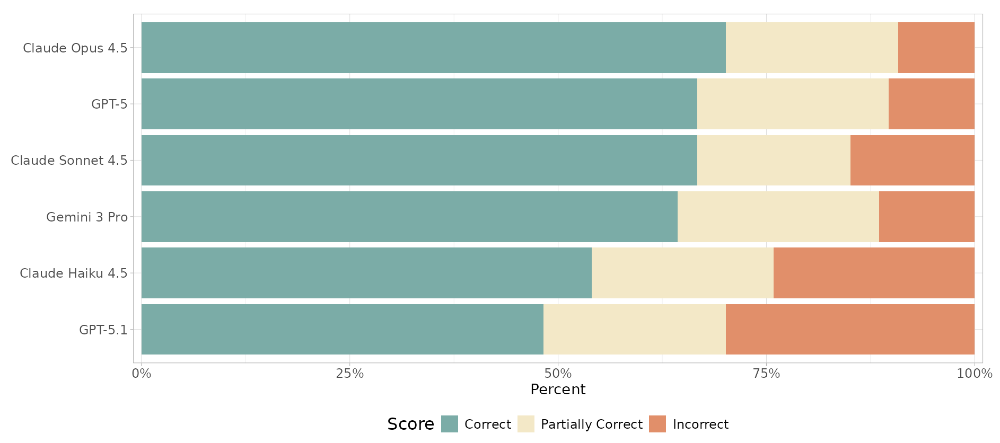

## Welcome

- AI is transforming the way research is done
- AI is *rapidly* evolving - tools and capability changing daily (**this will probably all be out of date next week!**)
- Today I'll  focus on tools I've personally used, but this is by no means exhaustive
- Since tools are changing so rapidly, we'll also talk about best practices
- I'm no AI expert - but rather just an enthuastic (and optimistically skeptical) user
- I also really want to hear from *you*

## AI can help with each stage of the research process

1. Idea generation
2. Literature review
3. Data analysis
4. Writing and communication
5. Collaboration and project management

## A bit on different LLM options
- **Google's Gemini**
  - General purpose, good for lit review, idea generation, etc
  - Excellent data privacy protections through UCSB license

- **Anthropic's Claude**
  - Excellent for coding
  - Direct agentic integration with your IDE

- **GitHub Copilot**
  - Designed for coding, integration with your IDE and Github
  - Can use many LLM backends (Gemini, Claude, GPT, etc.)

## Data privacy

- Always check the data privacy policies of any AI tool you use
- UCSB's Gemini license has excellent protections
    - [Approved for P1/P2/P3/P4 sensitive data](https://cio.ucsb.edu/artificial-intelligence/genai-tools-ucsb)
    - Your data is not used to train models
    - Available for faculty and staff
- Claude Code has [settings](https://privacy.claude.com/en/collections/10672565-data-handling-retention) for data retention, whether your code is used to train models, etc

## Research process (1/5): Idea Generation

- Gemini, Claude, GPT
- Gemini Deep Research
- Gemini Gems

## Research process (2/5): Literature Review

- Google Scholar Labs
- Gemini Deep Research
- Gemini Gems
- Gemini Notebook LM
- Specialized tools: Research Rabbit, Nature Research Assistant, Elicit, Consensus

## Research process (3/5): Data analysis

**Coding agents: GitHub Copilot, Positron Assistant, Positron Databot, Claude Code, etc**

- Integrated directly into your IDE
- Have access to your codebase, file structure
- Can operate in different modes: **ask**, **edit**, or **agent**, depending on your needs and comfort level
- Great for data science workflows (but anything really)
- Often **“BYO-key”**
  - Can use any LLM backend - Claude, Gemini, etc.
  - You're also subject to that backend's data privacy policies

## Positron Databot

- Developed by **Posit** team (formerly RStudio) for **Positron** (modern polygot successor to RStudio IDE; VS Code fork)
- Allows you to interact with your data using natural language
- Designed for exploratory data analysis (can do ML too)
- Designed with responsible, **human-in-the-loop** use in mind ([Databot is not a flotation device](https://posit.co/blog/databot-is-not-a-flotation-device/))
- Uses a **WEAR** loop: **W**rite code, **E**xecute, **A**nalyze, **R**egroup

*"In my 30-year career writing software professionally, Databot is both the most exciting software I've worked on, and also the most dangerous." –Joe Cheng, Posit CTO*

## Positron Assistant
- Developed by **Posit** team for **Positron**
- General coding assistant for wide range of tasks
- Similar to Claude Caude, but specifically tailored for data science workflows, with specific R and Python tooling
- Can be used for code generation, debugging, documentation, and more
- Has access to your codebase and file structure, so it can provide more context-aware assistance
- **BYOK**: Can use various LLM backends (Claude, GPT, etc.)
- Can be used in  **ask**, **edit**, or **agent** mode

## What LLM is best for coding?

Short answer: **Claude** (*for R, at least for now*)

Check out [Claude's Constitution](https://www.anthropic.com/constitution)

Keep an eye on Posit's [AI Newsletter](https://posit.co/blog/2026-02-13-ai-newsletter/) and [R Benchmark tests](https://skaltman-model-eval-app.share.connect.posit.cloud)

## Which LLM backend for Positron Assistant and Databot: Claude or GitHub Copilot with Claude?

- Claude requires a paid account
- GitHub Copilot has a free education account option; but is otherwise paid as well
- GitHub Copilot gives access to Claude models (and others)
- Using Claude directly gives you access to full context window - it is capped when going through Copilot
- Using Claude directly is faster - otherwise everything goes through the Copilot proxy interface
- Using Claude through Copilot can quickly exhaust your Copliot credits (at least ith the education account)

## Now what about Claude Code?

- Claude Code has a VS Code extenion, which is similar to Positron Assistant: both provide agentic capabilities
- Assistant is tailored for data science with R and Python; Claude Code more towards general software engineering
- Claude Code can be used in VS Code or Positron; Assistant can only be used in Positron (and is tightly integrated)
- Assistant is BYOK; Claude Code only uses Claude models
- **Important**: Both Positon Assistant and Databot require an API key; so this works with pay-as-you-go Claude, but currently *not* with Claude Pro monthly subscription (that might change though)

## Getting fancy: Customizing your AI coding assistants

- **instructions.md**: Specify custom "always-on" instructions: coding standards, style guides, etc to use across all scripts (specify the *how*) (also called **claude.md** or **positron.md**)
- **prompts.md**: Define reusables prompts for tasks you commonly ask your assistant to do (e.g., "write a function that does X", etc) (specify the *what*)
- **agents.md**: Create custom agent personas that can perform specific tasks, such as data cleaning, EDA, or model training (specify the *who*)

## Research process (4/5): Writing and Communication

- Gemini, Claude, GPT
- Specialized tools: Research Rabbit, Nature Research Assistant, Elicit, Consensus
- Gemini Nano Banana for image generation (e.g., flowcharts, technical diagrams, etc)

## Research process (5/5): Collaboration and Project Management

- GitHub Copilot for project management and collaboration
  - Can generate issues, pull requests, documentation, etc
  - Can be used to review code and suggest improvements (either reviewing PRs, or even reviewing code *before* it's committed!)
  - Can help with project organization and workflow
  - Can be done either on GitHub website, or directly through Positron or VS Code IDE

- Various other AI-powered tools in Slack, Asana, Zoom, etc

## Examples

- Vincent Arel-Bundock's [Use LLMs to learn about any chapter of my 𝑀𝑜𝑑𝑒𝑙 𝑡𝑜 𝑀𝑒𝑎𝑛𝑖𝑛𝑔 book, or any function in the `marginaleffects` package for R or Python.](https://bsky.app/profile/vincentab.bsky.social/post/3mequg4gzts27) **(light lift)**
- Pedro Sant'Anna's [Comprehensive Guide to Multi-Agent Slide Development, Code Review, and Research Automation](https://psantanna.com/claude-code-my-workflow/workflow-guide.html) **(heavy lift)**

*(Thanks, Robert!)*

## Getting Started

**Recommended First Steps:**

1. Try Gemini for literature summaries
2. Become familiar with GitHub Copilot
3. Try coding assistent for your next data science task
4. Try making your own custom instructions file

## Resources

- [GenAI Tools at UCSB](https://cio.ucsb.edu/artificial-intelligence/genai-tools-ucsb)
- [Free Copilot course from GitHub](https://github.com/orgs/community/discussions/184217)
- [Getting started with Positron Assistant](https://positron.posit.co/assistant-getting-started.html)
- [Introducing Databot: An AI assistant for exploratory data analysis](https://posit.co/blog/introducing-databot/)

## Best Practices

1. **Verify** AI-generated content - *keep a human in the loop*
2. **Remain** accountable
3. **Cite** usage appropriately
4. **Check** sources
5. **Maintain** data privacy
6. **Document** your workflow
7. **Stay** critical, skeptical, and curious

## Thanks!

*This presentation created with Quarto, Positron, and GitHub Copilot*

**Reach out:** 
Gavin McDonald

[gmcdonald@bren.ucsb.edu](mailto: gmcdonald@bren.ucsb.edu)

## Discussion

- What AI tools are you currently using in your research?
- What challenges have you faced with AI tools?
- What are your thoughts on the ethical implications of AI in research?
- What are your best practices for using AI?